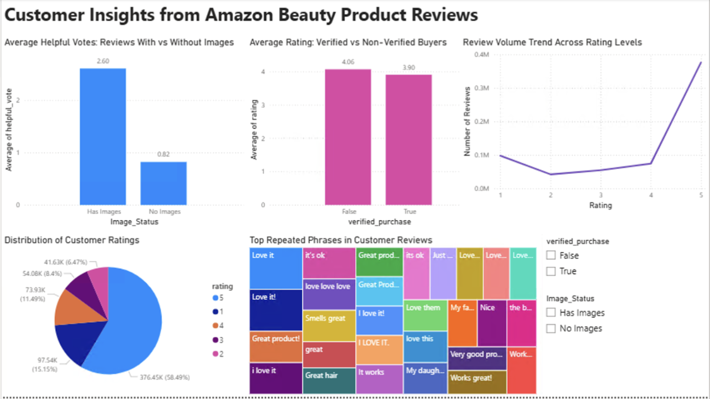

# amazon-beauty-review-analysis

## Overview
This project analyzes over 700,000 Amazon beauty product reviews to uncover patterns in customer engagement, review credibility, and product perception. The goal was to translate large-scale review data into clear, business-relevant insights.

## Tools Used
- SQL (data cleaning, aggregation, and analysis)
- Power BI (interactive dashboard and visualizations)
- Excel (initial exploration and validation)

## Key Business Questions
- Which beauty products have the highest average customer ratings?
- Which products show polarized customer feedback, indicated by a mix of high and low ratings?
- Do verified buyers tend to leave more positive reviews than non-verified buyers?
- What keywords appear most frequently in positive versus negative customer reviews?
- Do reviews that include images receive more helpful votes than reviews without images?

## Key Insights
- Reviews with images receive significantly more helpful votes than those without.
- Verified buyers leave slightly higher average ratings.
- Review distribution is heavily skewed toward positive ratings.
- Review volume increases sharply for higher ratings, particularly 5-star reviews.
- Review text often contains mixed sentiment, even within high ratings.

## Deliverables
- Interactive Power BI dashboard with filters and cross-highlighting
- Cleaned and deduplicated dataset
- Insight-driven visual analysis suitable for business and consulting contexts

## Preview

